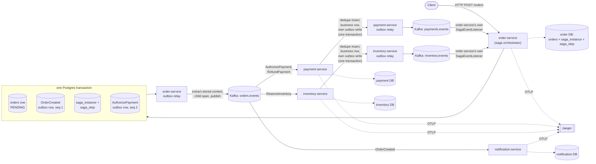

# EventForge

EventForge is a small order/payment/inventory system built to answer one question honestly: when a
business transaction spans a database and a message broker, and then spans multiple services after
that, what actually guarantees it stays correct — and what would it take to prove that guarantee
rather than assert it?

## Architecture



Every service owns its own Postgres database — no shared schema. Every service that publishes to
Kafka does it through the same outbox-and-relay mechanism shown above for order-service, enforced by
an architecture test (`NoDirectKafkaPublishArchitectureTest`, present in every service) that fails
the build if anything publishes to Kafka outside `OutboxWriter`. See
[docs/architecture.md](docs/architecture.md) for the full picture, including the fault-injection
points wired into every hop, and [docs/saga-state-machine.md](docs/saga-state-machine.md) for the
saga's states.

## The problems this solves

### The dual-write problem

Writing a business row to Postgres and publishing an event about it to Kafka are two separate
systems that cannot commit as one atomic operation. If the two calls happen separately, a crash
between them either loses the event while the database write survives, or announces an event whose
underlying write never actually landed — and no amount of retry logic on either call alone fixes
that, because retrying the wrong one just changes which of the two failure modes you get.

EventForge uses the transactional outbox pattern: `OrderService.createOrder` writes the `orders`
row and its `OrderCreated` outbox row (plus, since M3, the saga's own state and its first dispatched
command) inside one `@Transactional` method — one Postgres transaction, no distributed transaction,
no two-phase commit. A separate relay process polls that outbox table and publishes to Kafka on its
own schedule, marking a row published only after a real send succeeds, so the database write and the
Kafka publish are decoupled in time without ever being allowed to observably disagree.

- Code: [`order-service/.../domain/OrderService.java`](order-service/src/main/java/com/eventforge/order/domain/OrderService.java) (the one-transaction write), [`common-events/.../outbox/OutboxWriter.java`](common-events/src/main/java/com/eventforge/events/outbox/OutboxWriter.java), [`common-events/.../outbox/OutboxRelayWorker.java`](common-events/src/main/java/com/eventforge/events/outbox/OutboxRelayWorker.java) (the relay).
- Proven by: [`OutboxRelayCrashWindowIntegrationTest`](order-service/src/test/java/com/eventforge/order/OutboxRelayCrashWindowIntegrationTest.java) — a real Kafka broker taken down and brought back up mid-backlog with zero loss, and a real crash injected between the Kafka ack and the mark-published commit, against real Testcontainers Postgres and Kafka, not a mock of either.

### Duplicate delivery

At-least-once delivery is the honest floor for this kind of system, which means the same logical
event can be observed downstream more than once: a Kafka rebalance redelivers an unacknowledged
record, the relay's own send times out and retries a publish that actually landed on the broker, or
a consumer crashes after committing its business change but before acknowledging the offset. A
consumer that isn't built for this double-charges, double-reserves stock, or sends a notification
twice.

Every consumer in EventForge runs one transaction per message: insert into `processed_events`
keyed on `(consumer_group, event_id)`, perform the business mutation, write the next outbox event —
commit all three together, then acknowledge the Kafka offset manually, only after that commit
succeeds. A duplicate delivery hits the insert's uniqueness constraint and becomes a no-op before any
business logic runs.

- Code: [`common-events/.../consumer/ProcessedEventStore.java`](common-events/src/main/java/com/eventforge/events/consumer/ProcessedEventStore.java), [`payment-service/.../domain/PaymentAuthorizationService.java`](payment-service/src/main/java/com/eventforge/payment/domain/PaymentAuthorizationService.java).
- Proven by: [`DuplicateDeliveryIntegrationTest`](payment-service/src/test/java/com/eventforge/payment/DuplicateDeliveryIntegrationTest.java) (the same event redelivered repeatedly, one effect), [`ConcurrentDuplicateDeliveryIntegrationTest`](payment-service/src/test/java/com/eventforge/payment/ConcurrentDuplicateDeliveryIntegrationTest.java) (many threads racing the same event under real database contention), and [`RelayProducedDuplicateEndToEndTest`](payment-service/src/test/java/com/eventforge/payment/RelayProducedDuplicateEndToEndTest.java) (a duplicate the relay actually produces, consumed end to end, not a synthetic redelivery). Every mechanism that can produce a duplicate anywhere in this project, and which layer absorbs each one, is catalogued in [docs/duplicate-taxonomy.md](docs/duplicate-taxonomy.md).

### Saga compensation

A business transaction that spans services — authorize a payment, then reserve inventory — has no
database transaction to roll back if the second step fails after the first one already succeeded.
Something has to explicitly undo the first step, and something has to decide what happens if the
undo itself never gets confirmed, instead of retrying forever or pretending it succeeded.

EventForge runs an explicit, orchestrated saga inside order-service: `saga_instance.state` is a
persisted column, queryable directly in SQL at any point mid-flight, not reconstructed from event
history. A step's deadline is a persisted timestamp evaluated by a periodic sweep against an injected
clock, not an in-memory timer that dies with the process. When inventory reservation fails, the
orchestrator dispatches `RefundPayment`; if that itself goes unanswered, it is redispatched up to a
configured limit and then the saga moves to `COMPENSATION_FAILED` — a state distinct from ordinary
`COMPENSATED`, with a metric an operator would alert on and a documented manual remediation path,
not an infinite retry loop.

- Code: [`order-service/.../saga/SagaOrchestrator.java`](order-service/src/main/java/com/eventforge/order/saga/SagaOrchestrator.java), [`order-service/.../saga/SagaTimeoutSweeper.java`](order-service/src/main/java/com/eventforge/order/saga/SagaTimeoutSweeper.java).
- Proven by: [`SagaTimeoutIntegrationTest#permanentCompensationFailureReachesATerminalStateWithAnAlertAndNoInfiniteLoop`](order-service/src/test/java/com/eventforge/order/SagaTimeoutIntegrationTest.java) (the hard case — bounded retries, then a genuinely terminal state) and `#sagaStrandedByADeadInventoryConsumerEventuallyReachesATerminalStateAfterRestart` (the timeout sweep is restart-safe because the deadline lives in the database, not the process); [`SagaOrchestrationIntegrationTest`](order-service/src/test/java/com/eventforge/order/SagaOrchestrationIntegrationTest.java) for the happy and compensation paths. Runbook: [docs/runbooks/compensation-failure.md](docs/runbooks/compensation-failure.md).

### Trace continuity across async boundaries

A single logical request in this system crosses a database write, an asynchronous relay poll that
might happen seconds later, a Kafka hop, and another service's own consumer. Each of those
boundaries is a place a naive tracing setup either loses the thread and starts a new, disconnected
trace, or — the mistake almost everyone makes — has the relay copy the stored trace header verbatim,
which makes the relay invisible in the trace and makes the eventual consumer look like a sibling of
the original HTTP call instead of its descendant.

EventForge captures the active span's context into the outbox row at write time, inside the same
transaction as the business write. The relay does not copy that stored context onto the outgoing
Kafka record — it extracts it as a parent, opens its own child span representing the publish, and
injects that child's context into the record's headers, so the relay shows up as a real hop. The
next service's consumer extracts from the Kafka headers and continues the same trace from there.

- Code: [`common-events/.../tracing/EventForgeTracer.java`](common-events/src/main/java/com/eventforge/events/tracing/EventForgeTracer.java), and the relay's span logic in [`OutboxRelayWorker.java`](common-events/src/main/java/com/eventforge/events/outbox/OutboxRelayWorker.java).
- Proven by: [`TraceContinuityIntegrationTest#oneHttpRequestProducesOneTraceAcrossAllThreeRealServices`](e2e-tests/src/test/java/com/eventforge/e2e/TraceContinuityIntegrationTest.java) — three real Spring Boot services in one test, one HTTP request, one trace ID asserted across every span from the HTTP entry through inventory-service, with the parent-child structure checked explicitly rather than eyeballed in a UI — and [`RelayAsyncGapTraceIntegrationTest`](order-service/src/test/java/com/eventforge/order/RelayAsyncGapTraceIntegrationTest.java), which proves a real multi-second gap between the outbox write and the relay's publish stays one trace, not two.

## What is not claimed

EventForge is at-least-once, not exactly-once, and that distinction is load-bearing rather than
academic: the relay can and does publish the same event twice under real, tested conditions — a
crash between a successful Kafka send and the commit that marks the row published, or a client-side
send timeout racing a publish that actually landed — and Kafka's own producer idempotence setting
does not prevent either case, because both are a second, independent `send()` call issued by
EventForge's own code, not a retry of the first one that the broker could recognize and collapse.
What makes the system correct despite this is that every consumer absorbs the duplicate, not that
the duplicate is prevented from existing.

The "effectively-once" language used elsewhere in this project describes one specific, narrower
thing: a business effect written as a row in a Postgres database this project controls, inside the
same transaction as the dedupe check. `payment-service` "authorizing a payment" means writing a local
ledger row under that guarantee — it is not a claim about what happens with a real payment provider.
The moment a real charge happens over the network, that call sits outside any transaction this
project can make atomic, and the guarantee that remains is whatever the provider's own idempotency
key mechanism offers, not anything EventForge itself provides.

Ordering is per-partition, not global. Every event about a given order is keyed by that order's id
and lands in the same Kafka partition, which is what gives this project a real per-order ordering
guarantee — but there is no ordering guarantee, and no code anywhere that relies on one, across
different orders or across the cluster as a whole. This is a deliberate boundary, not a simplification
awaiting a fix.

Safety under concurrent relay workers depends on strict per-aggregate head-of-line blocking, not on
independent progress per row: the claim query only ever considers an aggregate's lowest unpublished
sequence number eligible, so a row that keeps failing to publish holds up every later event for that
same aggregate until it resolves or its retry backoff clears — by design, since that ordering
guarantee is the whole point, but it means one stuck aggregate accumulates its own backlog rather
than being skipped over.

Nothing in this project has been measured under load. Correctness under concurrency is verified
directly — multiple relay workers, concurrent duplicate deliveries, concurrent saga instances — but
efficiency under concurrency is not: how claim latency behaves as backlog or worker count grows,
whether row-lock contention on a hot aggregate becomes a bottleneck, and how quickly the outbox
table's dead-tuple churn accumulates under sustained retry are all open questions, not numbers this
README is going to guess at.

## Quickstart

Verified against a genuinely clean clone.

Prerequisites: Docker, with Compose v2 or later (`docker compose version`). Nothing else — Java and
Gradle are self-provisioned by the Gradle wrapper on first build. `order-service`'s own test suite
has a known, confirmed source of flakiness unrelated to host resources — see "Known limitations"
below before assuming a red `order-service` run means a real regression.

```
git clone <this repo>
cd eventforge

make up      # Kafka (KRaft), one Postgres per service, and Jaeger via Docker Compose;
             # builds all services; runs them as local JVM processes; waits until each
             # reports healthy via /actuator/health
make test    # the full test suite, Testcontainers-backed against real Postgres and
             # Kafka, independent of `make up` — see docs/adr/0008
make down    # stops the local service processes and tears down the Compose infra
```

Service ports after `make up`: order-service `8081`, payment-service `8082`, inventory-service
`8083`, notification-service `8084` (each exposes `/actuator/health`); Jaeger UI at `16686`.

To see one real, complete trace:

```
curl -X POST http://localhost:8081/orders \
  -H "Content-Type: application/json" \
  -d '{"amountCents":4200}'
```

then open `http://localhost:16686`, search for `order-service`, and open the `POST /orders` trace —
it will show every hop from the HTTP request through order-service's outbox and relay, into
payment-service and inventory-service and back, ending at the saga's terminal event. A committed
example is at [docs/img/jaeger-trace-order-saga.png](docs/img/jaeger-trace-order-saga.png).

## ADRs

Full text in [docs/adr/](docs/adr/); each records context, options considered, the decision, and
what would change it.

- [0001](docs/adr/0001-build-tool-gradle.md) — Gradle over Maven, specifically for JDK toolchain auto-provisioning on a clean clone.
- [0002](docs/adr/0002-event-schema-versioned-json.md) — Versioned JSON envelopes over Avro + Schema Registry; compatibility proven by a plain deserialization test, not registry enforcement.
- [0003](docs/adr/0003-topic-design-per-aggregate-type.md) — Topic-per-aggregate-type, partition key = `order_id`; per-order ordering only, never global.
- [0004](docs/adr/0004-outbox-and-processed-events-schema.md) — The `outbox_events`/`processed_events` schema, shaped in advance for per-aggregate claiming and an unpublished-only index; includes an amendment tracking real dead-tuple churn once the relay existed to generate it.
- [0005](docs/adr/0005-trace-context-propagation.md) — Trace context travels as Kafka headers plus durable outbox columns, never inside the event payload.
- [0006](docs/adr/0006-fault-injection-harness-seam.md) — The fault-injection interface lives in `common-events` (runtime-safe, no-op by default); the configurable test double lives in `common-testing`.
- [0007](docs/adr/0007-no-ddl-auto-flyway-only.md) — No JPA/Hibernate on the classpath at all until a real business entity needs it, so there is no `ddl-auto` setting to get wrong.
- [0008](docs/adr/0008-compose-scope-vs-testcontainers.md) — Compose is local-dev infra only; every test brings up its own Testcontainers infrastructure and never depends on Compose being up.
- [0009](docs/adr/0009-dependency-versions-and-spring-boot-4-modularization.md) — Pinned dependency versions and the non-obvious Spring Boot 4 per-technology starter split, recorded so later work doesn't regress onto stale assumptions.
- [0010](docs/adr/0010-outbox-relay-concurrency-model.md) — One-row-per-transaction claiming with `FOR UPDATE SKIP LOCKED` and a head-row-only eligibility restriction, safe under multiple concurrent relay workers; efficiency under concurrency is explicitly left unmeasured.
- [0011](docs/adr/0011-m1-trace-context-capture-without-otel-sdk.md) — M1 hand-generated W3C trace headers with no tracing SDK, deliberately, until M4 owned that infrastructure.
- [0012](docs/adr/0012-dedupe-key-and-processed-events-retention.md) — The dedupe key is `(consumer_group, event_id)`, not `event_id` alone; states plainly what breaks once `processed_events` rows are eventually purged, which no code here does yet.
- [0013](docs/adr/0013-effectively-once-boundary.md) — States precisely why "effectively-once" here means a local database row, not a real payment provider charge.
- [0014](docs/adr/0014-saga-orchestrator-location.md) — The saga orchestrator lives inside order-service, not as a fifth service, because that's what makes its atomicity claim provable.
- [0015](docs/adr/0015-saga-timeouts-and-the-hard-case.md) — Persisted timeout deadlines, bounded compensation retry, and the terminal `COMPENSATION_FAILED` state for when compensation itself never succeeds.
- [0016](docs/adr/0016-compensation-idempotency-three-layers.md) — Three independent idempotency layers protect `RefundPayment`, each catching a duplicate shape the others cannot.
- [0017](docs/adr/0017-opentelemetry-sdk-manual-wiring.md) — Real OpenTelemetry, manually wired rather than via the Spring Boot starter, for direct access to the specific propagation seams this project needs.
- [0018](docs/adr/0018-jaeger-as-the-collector.md) — Jaeger receives OTLP directly; no separate collector container, given this project's scale.
- [0019](docs/adr/0019-sampling-policy-and-parent-based-propagation.md) — Always-sample policy, parent-based propagation, and an amendment documenting a real sampling-flag bug the project's own test caught.
- [0020](docs/adr/0020-correlation-id-vs-trace-id.md) — `correlationId` and trace ID are never derived from one another: one is business-durable and always present, the other is observability tooling that can be sampled away.

## Known limitations, and what's next

- **`order-service`'s Testcontainers-backed tests were flaky for two confirmed, distinct, in-repo
  reasons — not host memory.** An earlier version of this section blamed a shared, constrained
  Docker host; that diagnosis was wrong, and was corrected once evidence contradicted it rather than
  left to stand.

  **Cause 1 (fixed): shared static containers across test classes.**
  `AbstractPostgresKafkaIntegrationTest`/`AbstractToxicKafkaIntegrationTest` declare Postgres and
  Kafka as `protected static final` — one field, shared by every subclass, initialized once per JVM
  and never reset. Gradle runs one module's whole `test` task in a single reused JVM by default, so
  all of `order-service`'s test classes were sharing one database and one broker: an earlier class's
  leftover rows, topics, and consumer-group offsets were visible to a later class. Confirmed by
  running `order-service` completely alone (no other module, no other project) three times — it
  still failed every time, a different class each time, which rules out cross-project contention as
  the cause. Fixed with `forkEvery = 1` on `order-service`'s `test` task (a fresh JVM, and therefore
  fresh containers, per class): the previously-flaky classes (`MultiWorkerRelayOrderingIntegrationTest`,
  `OutboxRelayCrashWindowIntegrationTest`, `RelayPublishSpanIntegrationTest`,
  `RelayUnderToxicNetworkIntegrationTest`) stopped recurring entirely across multiple genuinely
  fresh full-suite re-runs, at a measured wall-clock cost of about 13 seconds on this suite — see
  that build file's own comment for the full evidence and numbers.

  **Cause 2 (confirmed, not yet fixed): a real race against the background relay scheduler.**
  `RelayAsyncGapTraceIntegrationTest` kept failing even with `forkEvery = 1`, in complete isolation.
  Direct evidence, captured with a temporary diagnostic query on reproduction: the synthetic outbox
  row the test expects to publish itself already shows `published_at` set and `publish_attempts = 1`
  by the time the test's own explicit `relayWorker.relayNextEvent()` call runs. Something else
  published it first. `OutboxRelayScheduler`'s `@Scheduled` poller has no `initialDelay`, so its
  first tick fires on Spring's own async scheduling thread as soon as the scheduler infrastructure
  is ready — with no happens-before relationship to the test method's own thread. Under the right
  timing, that first tick lands *after* the test's synthetic row exists rather than before it,
  claims it, and the test's own call finds nothing left. At least ten of `order-service`'s test
  classes disable the scheduler only by setting its poll interval to an hour rather than by
  disabling it outright, so all of them carry the same structural exposure, even though only this
  one has reproduced it so far. This is a real bug — the correct fix is a way to obtain the relay
  worker bean without also starting its background scheduler, not a longer sleep or a retry loop,
  either of which would hide the race rather than close it. Not yet implemented; flagging it here
  rather than shipping a fix that wasn't verified against the actual cause.
- **`processed_events` has no retention policy**, and none of the duplicate-absorption tests exercise what happens once a row eventually ages out — [docs/duplicate-taxonomy.md](docs/duplicate-taxonomy.md) states the failure mode precisely (row 9) without a test forcing it, because there is no archival implementation yet to test against.
- **Orchestrator-redispatched commands racing their own original attempt** are reasoned through and handled in production code (the business-level safety net in `payment-service`) but not exercised by a test — every scenario this project's suite currently runs either never redispatches, or redispatches against a consumer that never answers at all (duplicate-taxonomy row 10).
- **`notification-service` has exactly one layer of duplicate protection**, not two, by deliberate design: a real external side effect (a sent notification) has no local database row to constrain a second attempt against the way `payment-service`'s and `inventory-service`'s business tables do. If its dedupe row ever ages out and a redelivery follows, a second real notification goes out, with nothing left to stop it.
- **The `e2e-tests` harness boots three real Spring Boot applications in one JVM on one shared test classpath**, which already produced one real bug during M4 (one service silently loading a sibling service's `application.yml`, fixed with explicit per-context property overrides) — a real limitation of the harness, not of the services it boots, worth knowing before extending it to a fourth.
- **Nothing has been measured under sustained load**: outbox claim-query behavior under a large backlog, dead-tuple accumulation on `outbox_events` under retry-heavy conditions, and consumer/relay throughput under real concurrency are all open, per ADR-0004 and ADR-0010 — this is the next milestone's actual job, not a gap to guess at here.
- **No autoscaling exists yet.** Every relay and consumer runs as a fixed local process; scaling either by Kafka consumer lag is unbuilt.
- **No CI pipeline exists in this repository.** `make test` is the whole verification story today, run locally or by whoever clones it.

What I'd do next, roughly in order: build the measurement work the ADRs above already call out by name (outbox bloat, claim-query latency, relay/consumer throughput) rather than adding new features on top of unmeasured foundations; then a `processed_events` retention policy, specifically so duplicate-taxonomy row 9 can move from Predicted to Proven against a real implementation instead of staying a documented hypothetical; then autoscaling the relay/consumers against Kafka consumer lag, since ADR-0010 already states multi-worker relay correctness holds today and nothing about that design blocks it.
