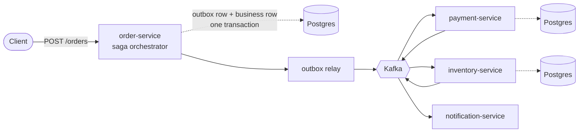
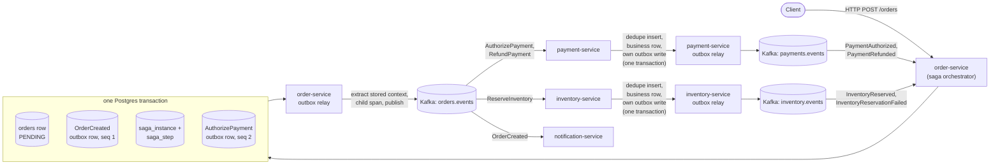
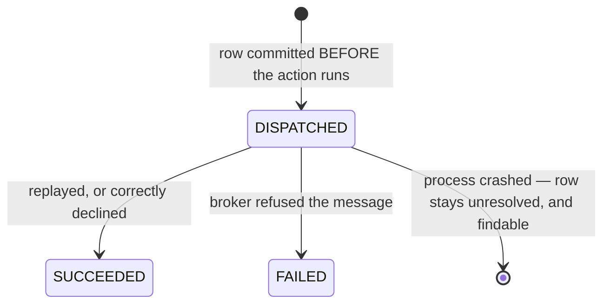

# EventForge

An event-driven distributed transaction platform in Java — transactional outbox, effectively-once
consumption, and saga compensation across four services, with the hard guarantees proven by
fault-injection tests against real Postgres and Kafka.

[](https://github.com/meetsutariya4448/EventForge/actions/workflows/ci.yml)


Placing an order authorizes payment and reserves stock across separate services, each owning its
own database. If a later step fails, earlier ones are compensated. The interesting part is what
happens when that goes wrong: a service crashes mid-transaction, a message arrives twice, or a step
never answers at all.



Each service owns its own Postgres database and never reads another's. Nothing is published
directly to Kafka — every event is written to an outbox table inside the same transaction as the
business data, and a relay publishes it afterwards.

<details>
<summary>Detailed flow — transaction boundaries, outbox sequencing, trace propagation</summary>



</details>

## Key properties, and what proves each one

Each of these is a guarantee the system makes, followed by the test that fails if it stops holding.

- **No dual write.** A business row and its event commit in one Postgres transaction; the relay
  publishes afterwards. A crash between the two cannot lose the event or announce one that never
  landed. → [`OutboxRelayCrashWindowIntegrationTest`](order-service/src/test/java/com/eventforge/order/OutboxRelayCrashWindowIntegrationTest.java)
  takes a real broker down mid-backlog and injects a crash between the Kafka ack and the
  mark-published commit.

- **Effectively-once consumption.** Delivery is at-least-once; the database effect happens once.
  Each consumer inserts into `processed_events` keyed on `(consumer_group, event_id)` in the same
  transaction as the business write, so a redelivery is a no-op before any logic runs. →
  [`ConcurrentDuplicateDeliveryIntegrationTest`](payment-service/src/test/java/com/eventforge/payment/ConcurrentDuplicateDeliveryIntegrationTest.java)
  races 16 threads on the same event under real database contention.

- **Saga compensation that terminates.** `saga_instance.state` is a persisted column and step
  deadlines are persisted timestamps, so a timeout survives a process restart. Unanswered refunds
  are retried a bounded number of times, then the saga reaches `COMPENSATION_FAILED` — a real
  terminal state with a metric and a runbook, not an infinite retry loop. →
  [`SagaTimeoutIntegrationTest`](order-service/src/test/java/com/eventforge/order/SagaTimeoutIntegrationTest.java)

- **Failures are captured, not dropped.** A record that exhausts its retries is written to
  `failed_messages` *before* its consumer offset is allowed to advance, so nothing is silently
  skipped. If that write fails, the partition stalls loudly and the record is redelivered. →
  [`FailureCaptureBeforeOffsetAdvanceIntegrationTest`](payment-service/src/test/java/com/eventforge/payment/FailureCaptureBeforeOffsetAdvanceIntegrationTest.java)
  and [`RecovererFailureLeavesOffsetUncommittedIntegrationTest`](payment-service/src/test/java/com/eventforge/payment/RecovererFailureLeavesOffsetUncommittedIntegrationTest.java)

- **One trace across every async hop.** The relay does not copy the stored trace header verbatim —
  it extracts it as a parent, opens its own child span for the publish, and injects that. An HTTP
  request, an outbox write, a relay poll seconds later, a Kafka hop and a downstream consumer stay
  one trace. → [`TraceContinuityIntegrationTest`](e2e-tests/src/test/java/com/eventforge/e2e/TraceContinuityIntegrationTest.java)

<details>
<summary>Longer explanation of each problem and how it is solved</summary>

### The dual-write problem

Writing a business row to Postgres and publishing an event about it to Kafka are two separate
systems that cannot commit as one atomic operation. If the two calls happen separately, a crash
between them either loses the event while the database write survives, or announces an event whose
underlying write never actually landed — and no amount of retry logic on either call alone fixes
that, because retrying the wrong one just changes which of the two failure modes you get.

EventForge uses the transactional outbox pattern: `OrderService.createOrder` writes the `orders`
row and its `OrderCreated` outbox row (plus the saga's own state and its first dispatched command)
inside one `@Transactional` method — one Postgres transaction, no distributed transaction, no
two-phase commit. A separate relay process polls that outbox table and publishes to Kafka on its own
schedule, marking a row published only after a real send succeeds.

Code: [`OrderService`](order-service/src/main/java/com/eventforge/order/domain/OrderService.java),
[`OutboxWriter`](common-events/src/main/java/com/eventforge/events/outbox/OutboxWriter.java),
[`OutboxRelayWorker`](common-events/src/main/java/com/eventforge/events/outbox/OutboxRelayWorker.java).

### Duplicate delivery

At-least-once delivery is the honest floor: a Kafka rebalance redelivers an unacknowledged record,
the relay's own send times out and retries a publish that actually landed, or a consumer crashes
after committing its business change but before acknowledging the offset. A consumer that isn't
built for this double-charges, double-reserves stock, or sends a notification twice.

Every consumer runs one transaction per message: insert into `processed_events`, perform the
business mutation, write the next outbox event — commit all three together, then acknowledge the
Kafka offset manually. Every mechanism that can produce a duplicate, and the layer that absorbs
each, is catalogued in [docs/duplicate-taxonomy.md](docs/duplicate-taxonomy.md).

### Saga compensation

A business transaction spanning services has no database transaction to roll back if the second
step fails after the first succeeded. Something has to explicitly undo the first step, and something
has to decide what happens when the undo itself is never confirmed.

The saga is explicit and orchestrated inside order-service. State is a queryable SQL column, not
reconstructed from event history. Deadlines are persisted timestamps evaluated against an injected
clock, not in-memory timers that die with the process. Runbook:
[docs/runbooks/compensation-failure.md](docs/runbooks/compensation-failure.md).

### Trace continuity

The mistake almost everyone makes is having the relay copy the stored trace header verbatim, which
makes the relay invisible and makes the downstream consumer look like a sibling of the original HTTP
call rather than its descendant. EventForge captures the active context into the outbox row at write
time, then the relay extracts it as a *parent* and injects its own child span's context instead.

</details>

## The audit trail's two-phase shape

An operator replay writes an `operator_action` row that is committed **before** the replay runs,
then resolved afterwards — the same shape as a saga step. Recording only the outcome would lose the
one case worth auditing: an action that started and then crashed.



A `DISPATCHED` row does not mean the action failed. It means nothing recorded whether it succeeded,
which is why reconciling one means reading the target's own state. → [`OperatorActionAuditIntegrationTest`](order-service/src/test/java/com/eventforge/order/OperatorActionAuditIntegrationTest.java)

## Quickstart

Prerequisites: **Docker** with Compose v2 (`docker compose version`). Java and Gradle are
self-provisioned by the Gradle wrapper. **Node 20+** only if you want the console.

```bash
git clone https://github.com/meetsutariya4448/EventForge.git
cd EventForge

make up      # Kafka, one Postgres per service, Jaeger; builds and starts all four services
make test    # full suite, Testcontainers-backed, independent of `make up`
make down    # stop services and tear down infrastructure
```

Services listen on `8081`–`8084` (order, payment, inventory, notification); Jaeger UI on `16686`.

Place an order — endpoints require authentication, so credentials are not optional:

```bash
curl -X POST http://localhost:8081/orders \
  -u operator:operator \
  -H "Content-Type: application/json" \
  -d '{"amountCents":4200}'
```

Then open `http://localhost:16686`, search for `order-service`, and open the `POST /orders` trace to
see every hop from the HTTP request through the outbox and relay into the downstream services. A
committed example: [docs/img/jaeger-trace-order-saga.png](docs/img/jaeger-trace-order-saga.png).

The operator console (failed messages, replay, audit trail):

```bash
cd console && npm install && npm run dev   # http://localhost:5173
```

Sign in as `operator`/`operator` or `viewer`/`viewer`. These are unencoded `{noop}` development
credentials in `application.yml` — the authorization *rule* is what this project proves, not the
credential handling.

## How the guarantees are verified

"Proven by running" is the project's whole thesis, so the test strategy is not a footnote.

- **89 tests, no mocked infrastructure.** Every integration test runs against real Postgres and real
  Kafka via Testcontainers. `make test` runs all of them.
- **Fault injection at exact commit boundaries.** Named seams let a test crash the process at the
  precise point a guarantee depends on — after a DB commit but before a Kafka publish, after a
  business commit but before an offset ack, after a failure is captured but before the offset
  advances. These are the tests that make the guarantees more than assertions.
- **Negative controls where a test could pass for the wrong reason.** The multi-worker ordering test
  was checked against a deliberately naive claim query to confirm it actually detects the bug it
  guards; the OpenAPI drift test was checked against a corrupted spec.
- **CI on every push** — a six-job GitHub Actions matrix, green on the current commit.

```bash
./gradlew test                    # everything
./gradlew :payment-service:test   # one module
cd console && npm run e2e         # browser tests, needs `make up` first
```

## Scope and boundaries

Milestones M0–M4 are frozen and unchanged. v2 builds on top of them: CI, HTTP request idempotency,
authentication with `OPERATOR`/`VIEWER` roles, durable failure capture with operator replay, and a
TypeScript console.

What this project deliberately does **not** claim:

- **Not exactly-once.** The relay can and does publish the same event twice under tested conditions,
  and Kafka's producer idempotence does not prevent it — both cases are a second, independent
  `send()` from this project's own code. Correctness comes from consumers absorbing duplicates, not
  from duplicates being prevented.
- **"Effectively-once" means a local database row.** `payment-service` authorizing a payment writes
  a row in a database this project controls, inside the same transaction as the dedupe check. It is
  not a real payment-provider integration; once a charge happens over the network it sits outside
  any transaction here. See [ADR-0013](docs/adr/0013-effectively-once-boundary.md).
- **Ordering is per-partition, not global.** Events for one order share a partition and are ordered.
  Across different orders, there is no ordering guarantee and no code that relies on one.
- **Nothing has been measured under load.** Correctness under concurrency is verified directly;
  efficiency is not. Claim latency under a large backlog, lock contention on a hot aggregate, and
  dead-tuple churn are open questions, not numbers this README will guess at.
- **Runs locally.** Docker Compose and local JVM processes. There is no cloud deployment.
- **CI does not run the browser tests.** They need Docker infra plus four service processes; CI
  typechecks, lints and builds the console instead. Run them locally with `make up && npm run e2e`.
- **Out of scope by choice:** server-sent events for live console updates, and metrics dashboards.
  Neither would strengthen a guarantee the project already proves.

<details>
<summary>Known limitations worth reading before extending this</summary>

- **`processed_events` has no retention policy.** [docs/duplicate-taxonomy.md](docs/duplicate-taxonomy.md)
  row 9 states precisely what breaks once rows age out; no archival implementation exists to test
  against.
- **Concurrent relay workers depend on head-of-line blocking.** The claim query only considers an
  aggregate's lowest unpublished sequence eligible, so a row that keeps failing holds up later
  events *for that aggregate* until it resolves — by design, since ordering is the point.
- **`notification-service` has one layer of duplicate protection, not two**, deliberately: a real
  external side effect has no local row to constrain a second attempt against.
- **The e2e tracing test boots three services in one JVM.** That is a limitation of the harness,
  not the services, and it already produced one real bug (a service loading a sibling's
  `application.yml`).
- **Generated console types are all-optional**, because the Java records do not declare
  required-ness in the OpenAPI description. See [console/README.md](console/README.md).

</details>

## Design decisions

Twenty-two ADRs record the context, options and reasoning behind every significant choice — why
Gradle over Maven, why versioned JSON envelopes over Avro, why the saga lives inside order-service,
why replay is allowed to publish outside the outbox. Full text in [docs/adr/](docs/adr/).

Further reading: [docs/architecture.md](docs/architecture.md) ·
[docs/duplicate-taxonomy.md](docs/duplicate-taxonomy.md) ·
[docs/saga-state-machine.md](docs/saga-state-machine.md) ·
[docs/runbooks/](docs/runbooks/)
