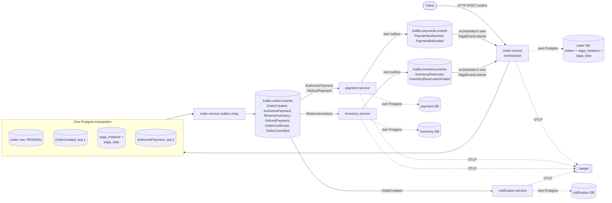
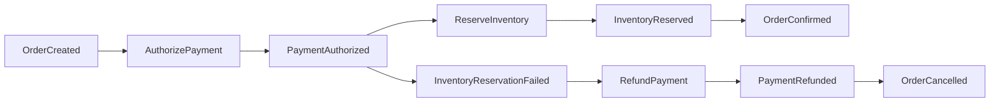

# Architecture

EventForge is complete and feature-frozen at M4. The outbox relay (M1), idempotent consumers (M2),
the orchestrated saga with real inventory reservation semantics (M3), and real OpenTelemetry
distributed tracing across every hop (M4) all exist and are proven against real infrastructure —
this document describes what was actually built, not a target still being worked toward. Milestones
M5 onward — DLQ design, autoscaling, and measured performance — were deliberately never started;
see the ADR index in [../README.md](../README.md) for what each would have added, and "What is not
claimed" in the same file for the boundary this project stops at.

## Message flow (as built, M4)



Every hop above that opens a span — the HTTP entry, every outbox relay's publish, every consumer's
entry — exports to Jaeger over OTLP (M4). The relay does not copy the stored trace context onto the
outgoing Kafka record; it extracts that context as a parent, opens its own child span for the
publish, and injects the child's context into the record's headers, so the relay is a real,
visible hop rather than an invisible pass-through — see ADR-0017 and
[docs/adr/0005-trace-context-propagation.md](adr/0005-trace-context-propagation.md)'s M4 note.

Every service owns its own Postgres database — no shared schema, ever. Every service that
publishes events uses the same outbox mechanism as order-service, not just order-service; otherwise
only `OrderCreated` is protected and later saga events reintroduce the dual-write problem the
outbox exists to solve — see the `NoDirectKafkaPublishArchitectureTest` in every service, which
fails the build if that's ever violated (constitution item 7, M3). All saga commands the
orchestrator dispatches (`AuthorizePayment`, `ReserveInventory`, `RefundPayment`) and its own
terminal events (`OrderConfirmed`, `OrderCancelled`) multiplex onto order-service's existing
`orders.events` topic, exactly the same `event_type`-filtering pattern M2 established for
`OrderCreated` — no new per-command topics.

## Saga (orchestrated with persisted state — not choreographed, not in-memory; M3)



See `docs/saga-state-machine.md` for the full `saga_instance.state` state diagram, including the
timeout and permanent-compensation-failure transitions this happy/compensation-path diagram doesn't
show, and ADR-0014/0015/0016 for the design decisions behind it.

## Consumer transaction shape (the core invariant — proven, M2)

```
BEGIN
  INSERT processed_event(consumer_group, event_id)   -- unique violation ⇒ already handled, no-op
  perform business mutation
  INSERT next outbox event
COMMIT
then acknowledge Kafka offset (manual ack, never auto-commit)
```

## Ordering guarantee

Kafka guarantees ordering only within a single partition. EventForge relies on per-order ordering
exclusively — every event about a given order is keyed by `order_id` and lands in the same
partition of its aggregate-type topic (see ADR-0003). There is no ordering guarantee, and no
reliance on one, across different orders or across the cluster as a whole.

## What exists today (M4)

- `common-events`: the `EventEnvelope` record and its Jackson (de)serialization contract; the
  `FaultInjector` seam (interface + no-op default), now wired to all three real call sites in the
  constitution (see below);
  `EventForgeTracer` (a real, manually-wired OpenTelemetry SDK — M4 replaced M1's hand-generated
  `TraceContextCapture` string surgery entirely; see ADR-0011 for what M1 did instead and
  ADR-0017 for why M4's SDK is wired by hand rather than via the Spring Boot starter). The stored
  `traceparent`/`tracestate` outbox column format did not change between M1 and M4 — only how
  those strings are produced and what the relay does with them did (see below and ADR-0005's M4
  note);
  `OutboxWriter` (the one write-side mechanism every publishing service reuses) and the reusable
  `OutboxRelayWorker`/`OutboxRelayScheduler`/`OutboxRelayAutoConfiguration` (single-worker,
  one-row-per-transaction claim/publish/mark-published cycle — ADR-0010), off by default per
  service, enabled via `eventforge.outbox.relay.enabled`. The relay takes an injected `Clock` and a
  configurable `retryBackoffMs`: a recoverable publish failure records the attempt (durably) and
  leaves the row eligible again only after the backoff window elapses, evaluated against that
  clock rather than the database's own `now()`, so it's deterministically testable. The claim query
  restricts to each aggregate's head row and orders candidates by longest-waiting first — a fix
  discovered directly by this session's crash-window tests, which found that ordering by
  `aggregate_id` alone lets one persistently-failing aggregate starve every other aggregate in the
  table (head-of-line blocking under retry). `OutboxRelayScheduler` polls adaptively: it keeps
  draining immediately, with no sleep, for as long as a pass fills the batch cap; it only falls
  back to the configured interval once a pass comes up short (nothing left, or a failure) — see the
  ADR-0010 amendment for why a fixed interval isn't used.
- `common-testing`: shared Testcontainers base class (real Postgres + real Kafka, no mocking), and
  the configurable fault-injector test double.
- `common-events` (M2 additions): `ProcessedEventStore` (the one dedupe primitive every consumer
  reuses — `INSERT ... ON CONFLICT (consumer_group, event_id) DO NOTHING`, never a caught exception;
  see ADR-0012 for why the key is composite) and `KafkaConsumerResilienceAutoConfiguration`
  (bounded-retry `DefaultErrorHandler` backed by `FixedBackOff`, paired with Spring Kafka's real
  `ContainerPausingBackOffHandler`/`ListenerContainerPauseService` so an exhausted-retry record
  pauses and later resumes its own partition's container rather than being retried forever — no
  Resilience4j, no DLQ, no retry topics, per the constitution's explicit non-goals).
- `order-service`: has a real `Order` entity/repository/service/controller (`POST /orders`) — the
  first real business writes in the project. `OrderService.createOrder` is where the M1 claim is
  proven: the order row and its `OrderCreated` outbox row commit in one `@Transactional` method,
  one Postgres transaction, no distributed transaction. The outbox relay is enabled here, publishing
  to the `orders.events` topic (auto-provisioned via a `NewTopic` bean, 3 partitions/replica 1 —
  ADR-0003). Kafka producer is explicitly configured with `enable.idempotence=true`/`acks=all`
  (trap T2), asserted by a test against the real `ProducerFactory`, not just application.yml.
  `OutboxRelayCrashWindowIntegrationTest` (its own dedicated Postgres + Kafka containers, so it can
  safely pause/unpause the broker without affecting other tests) is the headline M1 proof: broker
  outage with zero-loss catch-up, a crash between Kafka ack and commit with the resulting duplicate
  asserted as correct, bounded backoff-driven retry via an injected `Clock`, and a relay "restart"
  mid-backlog that resumes and preserves per-aggregate order.
  `MultiWorkerRelayOrderingIntegrationTest` verifies the same head-row claim design holds under N
  real concurrent workers (T1 is solved — see ADR-0010's amendment). `common-testing` also now
  provides `AbstractToxicKafkaIntegrationTest` (Kafka fronted by a real Toxiproxy proxy, verified
  by `RelayUnderToxicNetworkIntegrationTest`) for injecting connection-refused and latency
  failures — infrastructure built for M7's slow-broker measurement, not consumed by M1 itself.
  See `docs/duplicate-taxonomy.md` for every mechanism that can produce a duplicate in this
  project, which layer absorbs each, and the test that proves it.
- `order-service` (M3 additions, `com.eventforge.order.saga`): the saga orchestrator —
  `SagaOrchestrator` (dispatches commands, advances on facts, all state-guarded — see ADR-0016),
  `SagaEventListener` (order-service's own consumer, on `payments.events`/`inventory.events`,
  first time order-service consumes rather than only produces), `SagaTimeoutSweeper` (the
  persisted-deadline timeout mechanism, ADR-0015), and the `saga_instance`/`saga_step` tables
  (`V4__create_saga_tables.sql`) — inspectable via plain SQL mid-flight, the whole point of choosing
  orchestration (constitution item 1). Lives inside order-service rather than as a fifth service —
  see ADR-0014 for why. `SagaOrchestrationIntegrationTest`, `SagaTimeoutIntegrationTest`, and
  `ConcurrentSagaIntegrationTest` prove the happy path, compensation path, persisted-timeout
  restart-safety, the permanent-compensation-failure terminal state, the state-guard's rejection of
  an out-of-state fact, and non-interference across concurrent sagas.
- `payment-service`: consumes the orchestrator's explicit `AuthorizePayment`/`RefundPayment`
  commands from `orders.events` under consumer group `payment-service` (M3: no longer reacts to raw
  `OrderCreated` directly — orchestration, not choreography, per constitution item 1), running the
  full consumer transaction (dedupe insert, `payments` row write, next outbox write, one
  transaction, manual ack only after commit — auto-commit disabled and asserted against the real
  `ConsumerFactory`/container factory, not just YAML). Its business logic is deliberately a local
  ledger row, not a real payment call — see ADR-0013 (T4) for exactly what that means and what
  changes with a real provider. `RefundPayment` is protected by three independent idempotency
  layers, not one — see ADR-0016.
- `inventory-service`: consumes the orchestrator's `ReserveInventory` command (M3, superseding M2's
  minimal "just record we saw it" stub) with real stock arithmetic — `InventoryItem`
  (`available_quantity`, checked and decremented under a real `SELECT ... FOR UPDATE` row lock) and
  `InventoryReservation`. A genuine insufficient-stock condition is a real business failure
  (`InventoryReservationFailed`), not a fault-injection hook standing in for one.
  `ConcurrentInventoryReservationIntegrationTest` proves the row lock actually serializes real
  concurrent contention over scarce shared stock (constitution item 8f): exactly as many
  reservations succeed as there was stock for, never negative, never left unclaimed.
- `notification-service`: consumes the same topic under its own, separate consumer group
  (`notification-service`), the only service in the topology whose sole justification is
  demonstrating independent consumer-group offsets on a shared topic — proven, not assumed, by
  `IndependentConsumerGroupOffsetsIntegrationTest` (see `docs/duplicate-taxonomy.md`'s "what M2
  actually built" section). Its `sent_notifications` table deliberately carries no uniqueness
  constraint, unlike the other two services' business tables — a real external effect has no local
  row to constrain a second attempt against, and that gap is left visible rather than papered over
  (ADR-0012). Unchanged in M3 — still consumes `OrderCreated` only, not part of the saga.
- `docker/docker-compose.yml`: Kafka (KRaft), one Postgres per service, and (M4) Jaeger, for local
  `make up` — see ADR-0008 for why this is deliberately separate from the Testcontainers-managed
  containers the test suite uses.
- All four services (M4): the write-side operation captures the ACTIVE span's context
  (`EventForgeTracer.captureCurrentContext()`) into the outbox row at write time — never
  fabricated, never the relay's own context (trap T5). The relay does not copy that stored context
  verbatim onto the outgoing Kafka record; it extracts it as a parent, opens its own CHILD span for
  the publish, and injects that child's context into the headers, so the relay is a real, visible
  hop rather than an invisible pass-through — the mistake constitution item 3 warns almost every
  implementation makes. The next service's consumer extracts from the Kafka headers and continues
  the same trace. Sampling is `ParentBased`, always-on for this project's current scale, and the
  sampled/not-sampled flag is proven to survive the outbox and the relay unchanged — see ADR-0019,
  including its amendment on a real sampling-flag bug the project's own test caught. Structured
  JSON logs (`logging.structured.format.console: ecs`) carry `trace_id`/`span_id` on every line.
  `correlationId` and the trace ID are two entirely separate mechanisms, never derived from one
  another — see ADR-0020.
- `e2e-tests` (M4, new module): boots order-service, payment-service, and inventory-service as
  three real Spring Boot applications in one JVM against one shared Testcontainers Kafka/Postgres
  set. `TraceContinuityIntegrationTest` issues one real HTTP request, lets the saga run to
  completion, and asserts — against a real in-memory span exporter, not a screenshot — that a
  single trace ID spans every hop from the HTTP entry through inventory-service, with the correct
  parent-child structure at each one. Doing this exposed a real bug specific to this harness (three
  services sharing one test classpath, one silently loading a sibling service's
  `application.yml`), documented in the test class's own Javadoc rather than papered over.

## Fault-injection seam — every point wired (three in M2, two more in v2 WS3)

`FaultInjectionPoint.AFTER_DB_COMMIT_BEFORE_KAFKA_PUBLISH` fires in `OrderController`, right after
the order+outbox transaction commits — a real crash here would leave a durable, unpublished outbox
row for the relay to find later, proving the outbox pattern's actual point.
`FaultInjectionPoint.AFTER_KAFKA_PUBLISH_BEFORE_MARK_PUBLISHED` fires in `OutboxRelayWorker`, right
after the Kafka publish succeeds and before the row is marked published — a crash here leaves the
row unpublished and it gets republished on the next poll (at-least-once, by design; M2's idempotent
consumers are what absorb the resulting duplicate). Both are proven by
`OutboxAndRelayIntegrationTest`, not just declared.
`FaultInjectionPoint.AFTER_BUSINESS_COMMIT_BEFORE_OFFSET_ACK` fires in each service's
`@KafkaListener` (`PaymentEventListener`, `InventoryCommandListener`, and M3's `SagaEventListener`),
right after the consumer transaction commits and before `ack.acknowledge()` — a real crash here
leaves the offset uncommitted, so the broker redelivers the already-processed event, and it's the
dedupe insert (not offset position) that keeps the resulting redelivery a no-op. Proven by
`CrashAfterCommitBeforeAckIntegrationTest`.

v2 WS3 added two more, both in `DurableFailureRecoverer` and both about the same ordering:
`FaultInjectionPoint.BEFORE_FAILURE_CAPTURE` fires before a failed record is written to
`failed_messages` — a crash here must leave the offset uncommitted, so the record is redelivered
rather than skipped with nothing remembering it, and the partition resumes on its own once the
store is reachable (`FailureStoreUnavailableIntegrationTest`).
`FaultInjectionPoint.AFTER_FAILURE_CAPTURE_BEFORE_OFFSET_ADVANCE` fires after that row is committed
and before the offset moves past the record; a crash here leaves exactly one captured row after
redelivery, because the capture's own `ON CONFLICT DO NOTHING` is keyed on the record's physical
coordinates rather than on an `event_id` a poison record may not have.
