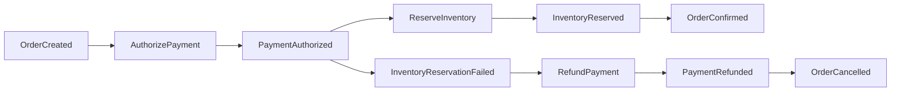

# Architecture

This describes EventForge's **target** architecture across all 10 milestones. As of M0, only the
event contract (`common-events`), the fault-injection seam (`common-events`/`common-testing`), and
the `outbox_events`/`processed_events` schema exist. There is no outbox relay, no saga
orchestration, and no consumer business logic yet — the diagram below is the destination, not the
current state.

## Target flow


Every service owns its own Postgres database — no shared schema, ever. Every service that
publishes events uses the same outbox mechanism as order-service, not just order-service; otherwise
only `OrderCreated` is protected and later saga events reintroduce the dual-write problem the
outbox exists to solve.

## Saga (target, orchestrated with persisted state — not choreographed, not in-memory)



## Consumer transaction shape (the core invariant, target for M2+)

```
BEGIN
  INSERT processed_event(consumer_group, event_id)   -- unique violation ⇒ already handled, no-op
  perform business mutation
  INSERT next outbox event
COMMIT
then acknowledge Kafka offset (manual ack, never auto-commit)
```

## Ordering guarantee

Kafka guarantees ordering only within a single partition. EventForge relies on per-order ordering
exclusively — every event about a given order is keyed by `order_id` and lands in the same
partition of its aggregate-type topic (see ADR-0003). There is no ordering guarantee, and no
reliance on one, across different orders or across the cluster as a whole.

## What exists today (M0)

- `common-events`: the `EventEnvelope` record and its Jackson (de)serialization contract; the
  `FaultInjector` seam (interface + no-op default), with no relay/consumer code calling it yet.
- `common-testing`: shared Testcontainers base class (real Postgres + real Kafka, no mocking), and
  the configurable fault-injector test double.
- `order-service`, `payment-service`, `inventory-service`, `notification-service`: Spring Boot
  skeletons, each with its own Flyway-migrated `outbox_events`/`processed_events` schema (schema
  only — see ADR-0004), no business entities, no relay, no consumers.
- `docker/docker-compose.yml`: Kafka (KRaft) + one Postgres per service, for local `make up` — see
  ADR-0008 for why this is deliberately separate from the Testcontainers-managed containers the
  test suite uses.
