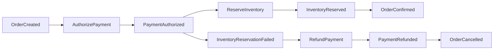

# Architecture

This describes EventForge's **target** architecture across all 10 milestones. As of M2, the outbox
relay (M1) and idempotent consumers (M2) both exist and are proven against real infrastructure; saga
orchestration and inventory reservation semantics (M3) do not exist yet — the diagram below is the
destination, not the current state in full.

## Target flow


Every service owns its own Postgres database — no shared schema, ever. Every service that
publishes events uses the same outbox mechanism as order-service, not just order-service; otherwise
only `OrderCreated` is protected and later saga events reintroduce the dual-write problem the
outbox exists to solve.

## Saga (target, orchestrated with persisted state — not choreographed, not in-memory)



## Consumer transaction shape (the core invariant — proven, M2)

```
BEGIN
  INSERT processed_event(consumer_group, event_id)   -- unique violation ⇒ already handled, no-op
  perform business mutation
  INSERT next outbox event
COMMIT
then acknowledge Kafka offset (manual ack, never auto-commit)
```

## Ordering guarantee

Kafka guarantees ordering only within a single partition. EventForge relies on per-order ordering
exclusively — every event about a given order is keyed by `order_id` and lands in the same
partition of its aggregate-type topic (see ADR-0003). There is no ordering guarantee, and no
reliance on one, across different orders or across the cluster as a whole.

## What exists today (M2)

- `common-events`: the `EventEnvelope` record and its Jackson (de)serialization contract; the
  `FaultInjector` seam (interface + no-op default), now wired to all three real call sites in the
  constitution (see below);
  `TraceContextCapture` (hand-generated/continued W3C `traceparent`, no OTel SDK yet — ADR-0011);
  `OutboxWriter` (the one write-side mechanism every publishing service reuses) and the reusable
  `OutboxRelayWorker`/`OutboxRelayScheduler`/`OutboxRelayAutoConfiguration` (single-worker,
  one-row-per-transaction claim/publish/mark-published cycle — ADR-0010), off by default per
  service, enabled via `eventforge.outbox.relay.enabled`. The relay takes an injected `Clock` and a
  configurable `retryBackoffMs`: a recoverable publish failure records the attempt (durably) and
  leaves the row eligible again only after the backoff window elapses, evaluated against that
  clock rather than the database's own `now()`, so it's deterministically testable. The claim query
  restricts to each aggregate's head row and orders candidates by longest-waiting first — a fix
  discovered directly by this session's crash-window tests, which found that ordering by
  `aggregate_id` alone lets one persistently-failing aggregate starve every other aggregate in the
  table (head-of-line blocking under retry). `OutboxRelayScheduler` polls adaptively: it keeps
  draining immediately, with no sleep, for as long as a pass fills the batch cap; it only falls
  back to the configured interval once a pass comes up short (nothing left, or a failure) — see the
  ADR-0010 amendment for why a fixed interval isn't used.
- `common-testing`: shared Testcontainers base class (real Postgres + real Kafka, no mocking), and
  the configurable fault-injector test double.
- `common-events` (M2 additions): `ProcessedEventStore` (the one dedupe primitive every consumer
  reuses — `INSERT ... ON CONFLICT (consumer_group, event_id) DO NOTHING`, never a caught exception;
  see ADR-0012 for why the key is composite) and `KafkaConsumerResilienceAutoConfiguration`
  (bounded-retry `DefaultErrorHandler` backed by `FixedBackOff`, paired with Spring Kafka's real
  `ContainerPausingBackOffHandler`/`ListenerContainerPauseService` so an exhausted-retry record
  pauses and later resumes its own partition's container rather than being retried forever — no
  Resilience4j, no DLQ, no retry topics, per the constitution's explicit non-goals).
- `order-service`: has a real `Order` entity/repository/service/controller (`POST /orders`) — the
  first real business writes in the project. `OrderService.createOrder` is where the M1 claim is
  proven: the order row and its `OrderCreated` outbox row commit in one `@Transactional` method,
  one Postgres transaction, no distributed transaction. The outbox relay is enabled here, publishing
  to the `orders.events` topic (auto-provisioned via a `NewTopic` bean, 3 partitions/replica 1 —
  ADR-0003). Kafka producer is explicitly configured with `enable.idempotence=true`/`acks=all`
  (trap T2), asserted by a test against the real `ProducerFactory`, not just application.yml.
  `OutboxRelayCrashWindowIntegrationTest` (its own dedicated Postgres + Kafka containers, so it can
  safely pause/unpause the broker without affecting other tests) is the headline M1 proof: broker
  outage with zero-loss catch-up, a crash between Kafka ack and commit with the resulting duplicate
  asserted as correct, bounded backoff-driven retry via an injected `Clock`, and a relay "restart"
  mid-backlog that resumes and preserves per-aggregate order.
  `MultiWorkerRelayOrderingIntegrationTest` verifies the same head-row claim design holds under N
  real concurrent workers (T1 is solved — see ADR-0010's amendment). `common-testing` also now
  provides `AbstractToxicKafkaIntegrationTest` (Kafka fronted by a real Toxiproxy proxy, verified
  by `RelayUnderToxicNetworkIntegrationTest`) for injecting connection-refused and latency
  failures — infrastructure built for M7's slow-broker measurement, not consumed by M1 itself.
  See `docs/duplicate-taxonomy.md` for every mechanism that can produce a duplicate in this
  project, which layer absorbs each, and the test that proves it.
- `payment-service`: consumes `OrderCreated` from `orders.events` under consumer group
  `payment-service`, running the full consumer transaction (dedupe insert, `payments` row write,
  `PaymentAuthorized` outbox write, one transaction, manual ack only after commit — auto-commit
  disabled and asserted against the real `ConsumerFactory`/container factory, not just YAML). Its
  business logic is deliberately a local ledger row, not a real payment call — see ADR-0013 (T4) for
  exactly what that means and what changes with a real provider.
- `inventory-service`: wired identically (dedupe, manual ack, resilience) under consumer group
  `inventory-service`, but its business mutation stays minimal (an insert recording receipt, no next
  outbox write) — reservation semantics are M3's scope, not M2's.
- `notification-service`: consumes the same topic under its own, separate consumer group
  (`notification-service`), the only service in the topology whose sole justification is
  demonstrating independent consumer-group offsets on a shared topic — proven, not assumed, by
  `IndependentConsumerGroupOffsetsIntegrationTest` (see `docs/duplicate-taxonomy.md`'s "what M2
  actually built" section). Its `sent_notifications` table deliberately carries no uniqueness
  constraint, unlike the other two services' business tables — a real external effect has no local
  row to constrain a second attempt against, and that gap is left visible rather than papered over
  (ADR-0012).
- `docker/docker-compose.yml`: Kafka (KRaft) + one Postgres per service, for local `make up` — see
  ADR-0008 for why this is deliberately separate from the Testcontainers-managed containers the
  test suite uses.

## Fault-injection seam — all three points wired (M2)

`FaultInjectionPoint.AFTER_DB_COMMIT_BEFORE_KAFKA_PUBLISH` fires in `OrderController`, right after
the order+outbox transaction commits — a real crash here would leave a durable, unpublished outbox
row for the relay to find later, proving the outbox pattern's actual point.
`FaultInjectionPoint.AFTER_KAFKA_PUBLISH_BEFORE_MARK_PUBLISHED` fires in `OutboxRelayWorker`, right
after the Kafka publish succeeds and before the row is marked published — a crash here leaves the
row unpublished and it gets republished on the next poll (at-least-once, by design; M2's idempotent
consumers are what absorb the resulting duplicate). Both are proven by
`OutboxAndRelayIntegrationTest`, not just declared.
`FaultInjectionPoint.AFTER_BUSINESS_COMMIT_BEFORE_OFFSET_ACK` fires in each service's
`@KafkaListener` (`PaymentEventListener`, `InventoryEventListener`), right after the consumer
transaction commits and before `ack.acknowledge()` — a real crash here leaves the offset uncommitted,
so the broker redelivers the already-processed event, and it's the dedupe insert (not offset
position) that keeps the resulting redelivery a no-op. Proven by
`CrashAfterCommitBeforeAckIntegrationTest`.
