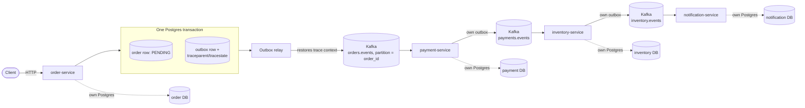
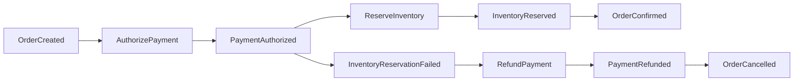

# Architecture

This describes EventForge's **target** architecture across all 10 milestones. As of M0, only the
event contract (`common-events`), the fault-injection seam (`common-events`/`common-testing`), and
the `outbox_events`/`processed_events` schema exist. There is no outbox relay, no saga
orchestration, and no consumer business logic yet — the diagram below is the destination, not the
current state.

## Target flow



Every service owns its own Postgres database — no shared schema, ever. Every service that
publishes events uses the same outbox mechanism as order-service, not just order-service; otherwise
only `OrderCreated` is protected and later saga events reintroduce the dual-write problem the
outbox exists to solve.

## Saga (target, orchestrated with persisted state — not choreographed, not in-memory)



## Consumer transaction shape (the core invariant, target for M2+)

```
BEGIN
  INSERT processed_event(consumer_group, event_id)   -- unique violation ⇒ already handled, no-op
  perform business mutation
  INSERT next outbox event
COMMIT
then acknowledge Kafka offset (manual ack, never auto-commit)
```

## Ordering guarantee

Kafka guarantees ordering only within a single partition. EventForge relies on per-order ordering
exclusively — every event about a given order is keyed by `order_id` and lands in the same
partition of its aggregate-type topic (see ADR-0003). There is no ordering guarantee, and no
reliance on one, across different orders or across the cluster as a whole.

## What exists today (M1)

- `common-events`: the `EventEnvelope` record and its Jackson (de)serialization contract; the
  `FaultInjector` seam (interface + no-op default), now wired to two real call sites (see below);
  `TraceContextCapture` (hand-generated/continued W3C `traceparent`, no OTel SDK yet — ADR-0011);
  `OutboxWriter` (the one write-side mechanism every publishing service reuses) and the reusable
  `OutboxRelayWorker`/`OutboxRelayScheduler`/`OutboxRelayAutoConfiguration` (single-worker,
  one-row-per-transaction claim/publish/mark-published cycle — ADR-0010), off by default per
  service, enabled via `eventforge.outbox.relay.enabled`. The relay takes an injected `Clock` and a
  configurable `retryBackoffMs`: a recoverable publish failure records the attempt (durably) and
  leaves the row eligible again only after the backoff window elapses, evaluated against that
  clock rather than the database's own `now()`, so it's deterministically testable. The claim query
  restricts to each aggregate's head row and orders candidates by longest-waiting first — a fix
  discovered directly by this session's crash-window tests, which found that ordering by
  `aggregate_id` alone lets one persistently-failing aggregate starve every other aggregate in the
  table (head-of-line blocking under retry). `OutboxRelayScheduler` polls adaptively: it keeps
  draining immediately, with no sleep, for as long as a pass fills the batch cap; it only falls
  back to the configured interval once a pass comes up short (nothing left, or a failure) — see the
  ADR-0010 amendment for why a fixed interval isn't used.
- `common-testing`: shared Testcontainers base class (real Postgres + real Kafka, no mocking), and
  the configurable fault-injector test double.
- `order-service`: has a real `Order` entity/repository/service/controller (`POST /orders`) — the
  first real business writes in the project. `OrderService.createOrder` is where the M1 claim is
  proven: the order row and its `OrderCreated` outbox row commit in one `@Transactional` method,
  one Postgres transaction, no distributed transaction. The outbox relay is enabled here, publishing
  to the `orders.events` topic (auto-provisioned via a `NewTopic` bean, 3 partitions/replica 1 —
  ADR-0003). Kafka producer is explicitly configured with `enable.idempotence=true`/`acks=all`
  (trap T2), asserted by a test against the real `ProducerFactory`, not just application.yml.
  `OutboxRelayCrashWindowIntegrationTest` (its own dedicated Postgres + Kafka containers, so it can
  safely pause/unpause the broker without affecting other tests) is the headline M1 proof: broker
  outage with zero-loss catch-up, a crash between Kafka ack and commit with the resulting duplicate
  asserted as correct, bounded backoff-driven retry via an injected `Clock`, and a relay "restart"
  mid-backlog that resumes and preserves per-aggregate order.
- `payment-service`, `inventory-service`, `notification-service`: unchanged skeletons — nothing to
  publish yet (that's M3's saga logic). They'll enable the same `common-events` relay mechanism
  with no new relay code once they do.
- `docker/docker-compose.yml`: Kafka (KRaft) + one Postgres per service, for local `make up` — see
  ADR-0008 for why this is deliberately separate from the Testcontainers-managed containers the
  test suite uses.

## Fault-injection seam — now wired (M1)

`FaultInjectionPoint.AFTER_DB_COMMIT_BEFORE_KAFKA_PUBLISH` fires in `OrderController`, right after
the order+outbox transaction commits — a real crash here would leave a durable, unpublished outbox
row for the relay to find later, proving the outbox pattern's actual point.
`FaultInjectionPoint.AFTER_KAFKA_PUBLISH_BEFORE_MARK_PUBLISHED` fires in `OutboxRelayWorker`, right
after the Kafka publish succeeds and before the row is marked published — a crash here leaves the
row unpublished and it gets republished on the next poll (at-least-once, by design; M2's idempotent
consumers are what absorb the resulting duplicate). Both are proven by
`OutboxAndRelayIntegrationTest`, not just declared.
