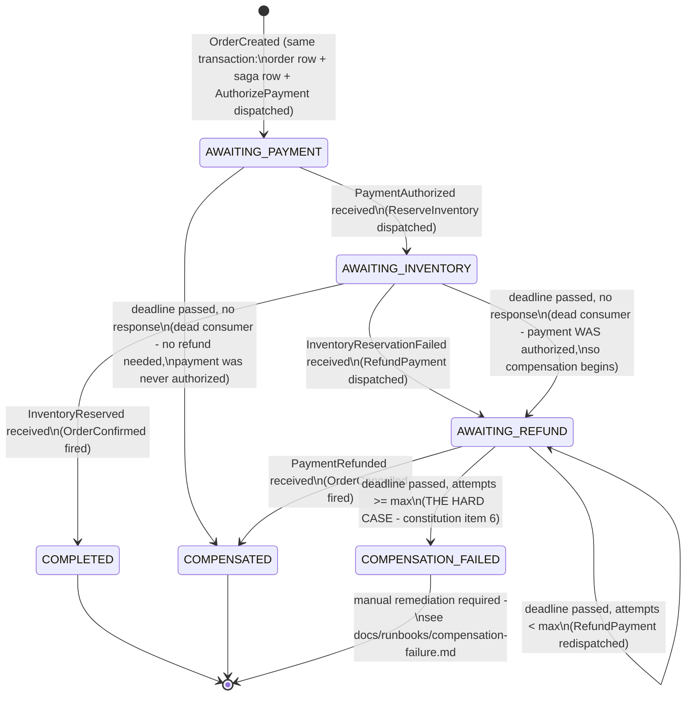

# Saga state machine

The orchestrated saga's states, transitions, and terminal outcomes (constitution item 9). State
names below are literally what `saga_instance.state` stores — this diagram is queryable, not
aspirational: `SELECT state FROM saga_instance WHERE order_id = ?` at any point returns one of
these node names.

## Reading this against the constitution's two named paths

**Happy path** (item 3): `AWAITING_PAYMENT` → `AWAITING_INVENTORY` → `COMPLETED`, driven by
`PaymentAuthorized` then `InventoryReserved`.

**Compensation path** (item 3): `AWAITING_PAYMENT` → `AWAITING_INVENTORY` → `AWAITING_REFUND` →
`COMPENSATED`, driven by `PaymentAuthorized` then `InventoryReservationFailed` then
`PaymentRefunded`.

**Timeout paths** (item 5) are the two self-loops and the `AWAITING_PAYMENT → COMPENSATED` edge
above, all driven by `saga_instance.deadline_at` — a persisted column, not an in-memory timer —
evaluated by `SagaTimeoutSweeper`'s periodic sweep against an injected `Clock`. Proven restart-safe
by `SagaTimeoutIntegrationTest`, which calls the sweep logic directly rather than waiting on the
real `@Scheduled` bean, the same determinism discipline `OutboxRelayCrashWindowIntegrationTest`
established for the relay.

**The hard case** (item 6): `AWAITING_REFUND`'s self-loop is bounded by
`eventforge.saga.max-compensation-attempts` (default 3) — once exhausted, the saga moves to
`COMPENSATION_FAILED`, a genuinely terminal state distinct from `COMPENSATED`. See
`docs/runbooks/compensation-failure.md` for what an operator does from there.

## What is not shown

Every arrow above corresponds to a `saga_step` row (`step_name`, `status` — `DISPATCHED`,
`SUCCEEDED`, or `FAILED` — `dispatched_at`, `completed_at`, `detail`), which is the actual audit
trail a mid-flight or historical saga is inspected through — this diagram shows the state machine's
shape, not the full row-level history. See ADR-0014 for why this lives in order-service's own
tables rather than a separate orchestrator service or store.
